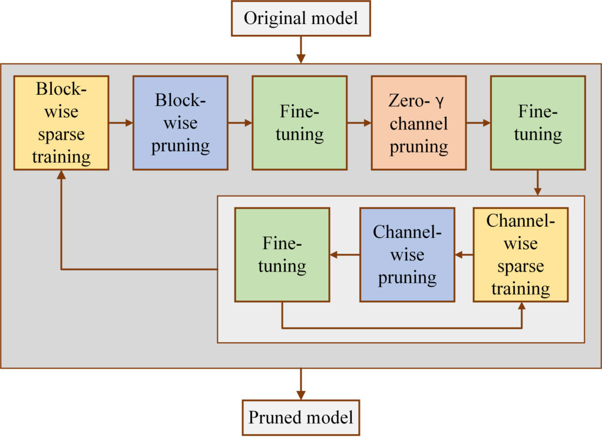

# Compression-of-YOLOv3-via-Block-wise-and-Channel-wise-Pruning [[Paper Link](https://ieeexplore.ieee.org/abstract/document/9412687)]

Nowadays, in the area of autonomous driving, the computational power of the object detectors is limited by the embedded devices and the public datasets for autonomous driving are over-idealistic. In this paper, we propose a pipeline combining both block-wise pruning and channel-wise pruning to compress the object detection model iteratively. We enforce the introduced factor of the residual blocks and the scale parameters in Batch Normalization (BN) layers to sparsity to select the less important residual blocks and channels. Moreover, a modified loss function has been proposed to remedy the class-imbalance problem. After removing the unimportant structures iteratively, we get the pruned YOLOv3 trained on our datasets which have more abundant and elaborate classes. Evaluated by our validation sets on the server, the pruned YOLO v3 saves 79.7% floating point operations (FLOPs), 93.8% parameter size, 93.8% model volume and 45.4% inference times with only 4.16% mean of average precision (mAP) loss. Evaluated on the embedded device, the pruned model operates about 13 frames per second with 4.53% mAP loss. These results show that the real-time property and accuracy of the pruned YOLOv3 can meet the needs of the embedded devices in complicated autonomous driving environments.

